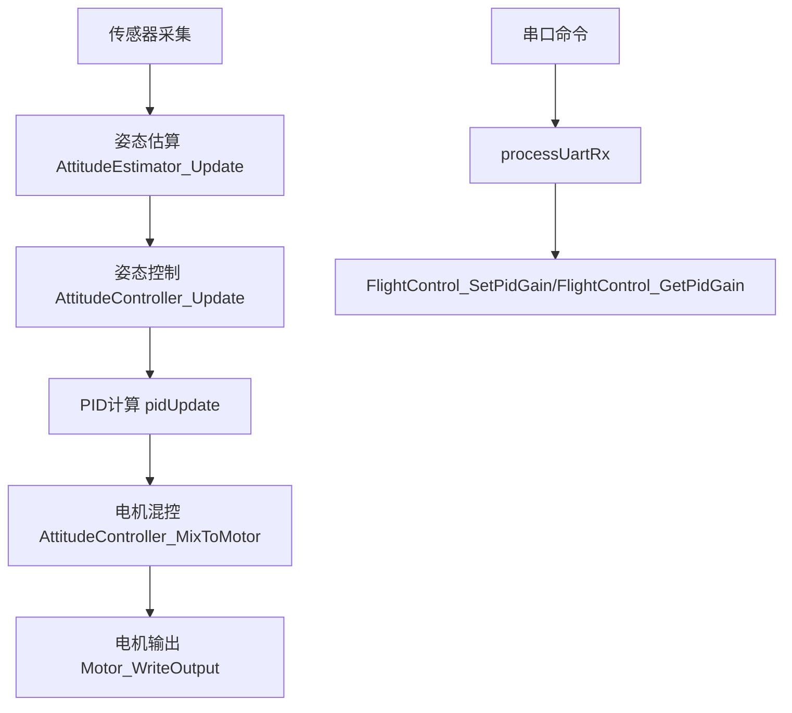

# STM32飞控项目PID控制过程详解（进阶版）

## 1. 控制流程总览

1. **传感器采集**：IMU（陀螺仪/加速度计）、磁力计、气压计采集原始数据。
2. **姿态估算**：通过Mahony互补滤波，融合IMU和磁力计，输出欧拉角/四元数。
3. **姿态/角速度/高度环PID控制**：根据目标值与当前值计算误差，输出控制量。
4. **电机混控与输出**：将控制量混控到四个电机PWM。
5. **参数在线调试**：支持串口命令实时读写PID参数。

## 2. 主要结构体与变量说明

### 2.1 AttitudeEstimator_t（姿态估算器）

```c
typedef struct {
    Quaternion_t q;         // 当前姿态四元数
    EulerAngle_t euler;     // 当前欧拉角（roll/pitch/yaw）
    float twoKp, twoKi;     // Mahony算法比例/积分增益
    float integralFBx, integralFBy, integralFBz; // 积分项
    float dt;               // 采样周期
    bool useMag;            // 是否用磁力计航向校正
    bool initialized;       // 是否已初始化
} AttitudeEstimator_t;
```

**功能**：融合IMU和磁力计，输出姿态。

### 2.2 PidObject（PID对象）

```c
typedef struct {
  float desired;      // 目标值
  float error;        // 当前误差
  float prevMeasured; // 上次测量值
  float integ;        // 积分项
  float deriv;        // 微分项
  float kp, ki, kd;   // PID参数
  float kff;          // 前馈参数
  float outP, outI, outD, outFF; // 各项输出
  float iLimit;       // 积分限幅
  float outputLimit;  // 总输出限幅
  float dt;           // 控制周期
  lpf2pData dFilter;  // D项滤波器
  bool enableDFilter; // D项滤波使能
} PidObject;
```

**功能**：实现单环路PID控制。

### 2.3 AttitudeController_t（姿态控制器）

```c
typedef struct {
    PidObject rollAnglePid, pitchAnglePid; // 姿态环PID
    PidObject rollRatePid, pitchRatePid, yawRatePid; // 角速度环PID
    float dt; // 控制周期
    float rollRateSp, pitchRateSp, yawRateSp; // 角速度目标
    float rollOut, pitchOut, yawOut; // PID输出
} AttitudeController_t;
```

**功能**：串级PID控制，先姿态后角速度。

### 2.4 FlightDebugData_t（调试数据快照）

```c
typedef struct {
    FlightState_t state; // 飞控状态（解锁/加锁/失控）
    float roll, pitch, yaw; // 当前姿态
    float rollSp, pitchSp, yawRateSp; // 目标值
    float rollOut, pitchOut, yawOut; // PID输出
    uint16_t throttle, m1, m2, m3, m4; // 电机输出
    uint8_t linkAlive, sensorCalibrated; // 遥控/传感器状态
} FlightDebugData_t;
```

## 3. 主要函数与实现步骤

### 3.1 AttitudeEstimator_Init

**功能**：初始化姿态估算器。
**步骤**：

1. 清零结构体，四元数设为单位，欧拉角设为0。
2. 设置采样周期dt、Mahony算法增益（kp/ki）、是否用磁力计。
3. 标记initialized为true。

### 3.2 AttitudeEstimator_Update

**功能**：姿态估算主入口，融合IMU和磁力计。
**步骤**：

1. 调用AttitudeEstimator_UpdateIMU，基于陀螺仪/加速度计更新四元数。
2. 若useMag为true，调用ApplyMagYawCorrection进行航向校正。
3. 四元数转欧拉角，输出姿态。

### 3.3 AttitudeEstimator_UpdateIMU

**功能**：Mahony互补滤波核心，融合陀螺仪/加速度计。
**步骤**：

1. 加速度归一化，计算重力方向与当前姿态误差。
2. 积分项累加，修正陀螺仪零漂。
3. 更新四元数，归一化。
4. 四元数转欧拉角。

### 3.4 ApplyMagYawCorrection

**功能**：磁力计航向校正。
**步骤**：

1. 磁力计数据归一化，投影到水平面。
2. 计算航向角与当前yaw误差。
3. 用alpha系数修正yaw，抑制漂移。

### 3.5 AttitudeController_Init

**功能**：初始化姿态控制器，配置PID参数。
**步骤**：

1. 初始化各环路PID对象。
2. 设置控制周期dt。

### 3.6 AttitudeController_Update

**功能**：串级PID控制，先姿态后角速度。
**步骤**：

1. 姿态环PID计算roll/pitch目标角速度。
2. 角速度环PID计算实际输出。
3. yawRate环独立控制。

### 3.7 pidInit/pidUpdate/pidReset

**功能**：PID对象初始化、更新、重置。
**步骤**：

1. pidInit：设置初始参数、限幅、滤波器。
2. pidUpdate：误差计算、积分/微分、输出限幅。
3. pidReset：积分项清零，测量值更新。

### 3.8 FlightControl_Init

**功能**：飞控主初始化，PID/姿态/电机等全部初始化。
**步骤**：

1. 姿态估算器、控制器、各环路PID初始化。
2. 电机PWM启动，安全输出。
3. 状态变量清零。

### 3.9 FlightControl_Task

**功能**：飞控主循环（FreeRTOS任务），周期性采集、估算、控制。
**步骤**：

1. 采集IMU/磁力计/气压计/遥控数据。
2. 校准零偏，姿态估算。
3. 生成目标，PID控制，混控输出。
4. 失控保护、解锁加锁逻辑。
5. 调试数据快照。

### 3.10 FlightControl_SetPidGain/FlightControl_GetPidGain

**功能**：在线读写PID参数，支持串口命令。
**步骤**：

1. 根据环路和参数类型定位PID对象。
2. 调用pidSetKp/pidSetKi/pidSetKd等接口读写。

### 3.11 串口命令解析（processUartRx等）

**功能**：解析串口命令，调用PID读写接口。
**步骤**：

1. 解析命令格式（如pid show/set）。
2. 调用FlightControl_SetPidGain/FlightControl_GetPidGain。
3. 输出结果到串口。

## 4. 典型数据流与调用关系



## 5. 主要文件分布

- `User/PID/pid.c/h`：PID对象结构、算法实现
- `User/FlightControl.c/h`：飞控主循环、PID对象、参数读写接口
- `User/AttitudeEstimator.c/h`：姿态解算、航向校正
- `User/AttitudeControl.c/h`：姿态控制器、混控输出
- `User/GY86.c/h`：传感器采集任务
- `User/User Task/uart_task.c/h`：串口调试输出、命令解析

## 6. 串口调参命令用法示例

- 显示参数：
  - `pid show attitude kp`
  - `pid show rate kd`
  - `pid show altitude ki`
- 设置参数：
  - `pid set attitude kp 1.2`
  - `pid set rate kd 0.05`
  - `pid set altitude ki 0.01`

## 7. 扩展建议

- 支持参数写入Flash断电保存
- 增加参数组管理与批量导入导出
- 优化命令解析容错与反馈

---

如需进一步扩展或详细解释某段代码，请随时提出。